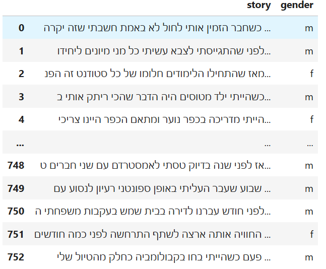
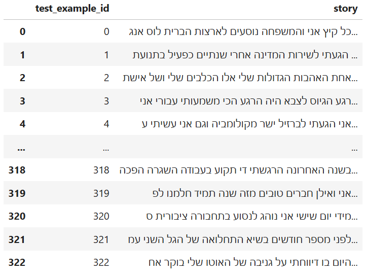

# Hebrew Text Gender Classification 

## Table of Content
* [General Info](#general-info)
* [Architecture](#architecture)
* [Results](#results)
* [Features](#features)

## General Info
The Hebrew Text Gender Classification Project explores the use of machine learning to classify gender (male or female) based on Hebrew text data. By addressing the unique challenges of working with a specialized language, the project showcases the development of a robust pipeline that combines data preprocessing, feature extraction, and advanced machine learning workflows to deliver accurate results.

The project begins with raw Hebrew sentences stored in Excel, which are meticulously cleaned and tokenized to prepare for machine learning analysis. Preprocessing removes unnecessary symbols, characters, and noise, ensuring that the data focuses exclusively on the linguistic elements relevant to gender classification. A custom tokenizer was implemented to handle the nuances of Hebrew text, transforming the data into a structured format ready for feature extraction.

For feature engineering, the project utilizes two prominent techniques: TF-IDF (Term Frequency-Inverse Document Frequency) and Count Vectorization. These methods convert the textual data into numerical representations, capturing the importance of words and phrases in the context of gender identification. The pipeline then leverages these features to train multiple machine learning models, including LinearSVC, MLPClassifier, and KNeighborsClassifier, each evaluated through cross-validation to ensure robust performance.

This project illustrates the application of machine learning in a real-world scenario, focusing on natural language processing for Hebrew—a language that poses unique challenges due to its script and structure. By combining preprocessing, feature engineering, and model optimization, the Hebrew Text Gender Classification Project highlights a comprehensive approach to building specialized AI systems.

## Features
1. Raw Data:
   * The dataset begins as an Excel file containing rows of sentences, each labeled with a corresponding gender ('m' for male or 'f' for female).
     
2. Data Preprocessing:
   * Text Cleaning:
     * Removed punctuation , symbols, digits, and other non-alphanumeric characters.
     * Eliminated English words from the Hebrew dataset, ensuring language consistency.
     * Standardized text to lowercase for uniformity.
  * Gender Label Validation:
    * Ensured that only valid gender labels ('m' for male and 'f' for female were present in the dataset. Invalid rows were discarded.
  * The following is the dataframe used to train the AI models:
      
  * The followinf is the dataframe used to test the AI models:
      
3. Tokenization:
   * Utilized a Hebrew tokenizer to extract meaningful tokens (words) from the text.
   * The tokenizer filtered and included only hebrew words, further removing noise from the dataset.

4. Feature Engineering:
   * TF-IDF Vectorization: Captured word importance by weighing term frequency against its inverse document frequency.
   * Count Vectorization: Represented the frequency of n-grams (single words or sequence of words) in the text.
  
5. Model Training and Cross Validation:
   * Models: Linear SVC, MLP Classifier, Perceptron, SGD Classifier, K Neighbors Classifier, Decision Tree Classifier.
   * Each model's performance was evaluated using 10-fold cross-validation, focusing on the F1-macro score to balance the evaluation between classes ('m' and 'f').

6. Hyperparameter Tuning:
   * GridSearchCV: Used to identify the best hyperparameters for each model, further improving their accuracy.
   * Performed seperatly for TF-IDF and Count Vectorization representations.

7. Final Predictions:
   * After Identifying the best model and vectorization method, predictions were made on unseen test data.
  
## Results

### Hyperparameter Tuning Overview
I performed hyperparameter tuning using GridSearchCV for multiple machine learning classifiers to identify the best configurations for each model. The following models were evaluated using F1-macro cross-validation scoring:
